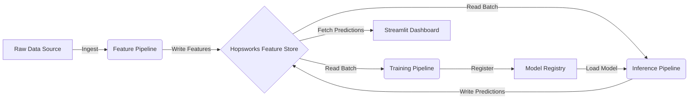

# 🚖 NYC Taxi Demand Forecasting Platform (MLOps)

[](https://www.python.org/)
[](https://www.hopsworks.ai/)
[](https://lightgbm.readthedocs.io/)
[](https://streamlit.io/)
[]()

## 📋 Executive Summary
This project implements an end-to-end **MLOps system** to forecast real-time taxi demand in New York City. Unlike static historical analysis, this platform provides **next-hour predictions** at a granular zone level, enabling fleet operators to optimize driver allocation and reduce passenger wait times.

The system leverages a **Feature Store architecture** to prevent training-serving skew and automates the entire lifecycle from data ingestion to model deployment and monitoring.

---

## 🏗️ System Architecture

The platform is built on a modular microservices architecture, decoupled into three independent pipelines:



## 📉 Model Performance & Results

The primary objective is to minimize the error in forecasting next-hour demand across all NYC zones. The model is evaluated using a strictly time-based split to prevent data leakage.

* **Target:** Next-hour demand per NYC zone (Regression)
* **Metric:** Mean Absolute Error (MAE)
* **Baseline:** "Same-hour last week" (Seasonal Naive approach)

| Model | MAE | RMSE | Notes |
| :--- | :--- | :--- | :--- |
| **Baseline (T-7 days)** | 5.82 | 8.14 | Simple seasonal sanity check. |
| **LightGBM (Production)** | **2.39** | **2.59** | **59% improvement** over baseline. |

### 🔍 Key Findings
* **LightGBM outperforms the seasonal baseline by nearly 60%**, validating that demand is driven by more than just weekly seasonality (e.g., recent trends, weather, holidays).
* The **2.39 MAE** indicates that, on average, the model's prediction is off by fewer than **3 rides per hour** for a given zone, which is highly actionable for fleet positioning.
* *Technical Note:* LightGBM was selected as the production model architecture after offline experimentation demonstrated it outperformed Linear Regression and XGBoost in both training efficiency and inference latency.
  
## 🤖 Machine Learning Approach

### 1. Feature Engineering Strategy
The model avoids reliance on complex external data (like weather) by engineering robust **Time-Series Features** that capture inherent demand cycles:

* **Temporal Features:**
    * **`hour` & `day_of_week`**: Extracted to capture daily commute patterns (e.g., AM/PM rush hours) and weekly seasonality (e.g., Friday night vs. Monday morning).
* **Lag & Window Features:**
    * **`average_rides_last_4_weeks`**: A powerful rolling-window feature that calculates the average demand for the **same hour** on the **same day** over the last 28 days. This allows the model to "remember" monthly trends and strict recurring patterns.
    * *Implementation:* `src.pipeline_utils.average_rides_last_4_weeks`

### 2. Model Training & Governance
* **Algorithm:** **LightGBM Regressor**. Chosen for its high efficiency with tabular data and ability to handle large-scale time-series datasets with minimal latency.
* **Champion/Challenger Evaluation:**
    * The training pipeline implements an automated **Gating Mechanism**.
    * Every new model candidate is evaluated against the current **Production Model** using Mean Absolute Error (MAE).
    * **Promotion Logic:** `if candidate_mae < production_mae: register_model()`. This ensures zero regression in production performance.

### 3. Production Inference Workflow
To simulate real-time production constraints, the inference pipeline runs on a strictly decoupled schedule:
1.  **Lookback Context:** Fetches the last **28 days** of batch data from the Feature Store to compute necessary lag features.
2.  **Forward Prediction:** Generates demand forecasts for the **Next Hour** (T+1).
3.  **Write-Back:** Predictions are materialized back into the Feature Store (`model_prediction` feature group), making them instantly available for the Streamlit dashboard via low-latency lookup.

## 📂 Project Structure

The project follows a modular MLOps directory structure, separating source code (`src`) from execution scripts and frontend logic.

```bash
├── src/
│   ├── config.py           # Centralized configuration (Feature Group names, Model versions)
│   ├── data_utils.py       # Raw data fetching and time-series aggregation logic
│   ├── pipeline_utils.py   # Scikit-learn transformers and LightGBM pipeline definition
│   └── inference.py        # Core inference logic for fetching batch data and predicting
├── pipelines/
│   ├── feature_pipeline.py # Orchestrator: Ingests raw data -> Feature Store
│   ├── training_pipeline.py# Orchestrator: Retrains model -> Model Registry
│   └── inference_pipeline.py# Orchestrator: Runs hourly predictions -> Feature Store
├── frontend/
│   └── frontend_v1.py      # Streamlit dashboard application
├── notebooks/              # Jupyter notebooks for exploratory data analysis (EDA)
├── requirements.txt        # Python dependencies
└── README.md
```

### Getting Started
**Prerequisites**
1. Python 3.9+
2. Hopsworks Account: A free account at hopsworks.ai to host the Feature Store.
3. Streamlit: For the frontend dashboard.

**Installation**
1. Clone the repository
git clone [https://github.com/sharmiladevi23/nyc-taxi-demand-forecasting-system.git](https://github.com/sharmiladevi23/nyc-taxi-demand-forecasting-system.git)
`cd nyc-taxi-demand-forecasting-system`

2. Install dependencies
   `pip install -r requirements.txt`
   
3. Configure Credentials Create a .env file in the root directory to store your secrets (do not commit this file):
   `HOPSWORKS_API_KEY="your_api_key_here"`
   `HOPSWORKS_PROJECT_NAME="nyc_taxi_proj"`

### 🏃‍♂️ Usage Guide
This system is designed to run as three independent micro-pipelines. You can trigger them manually or schedule them via Airflow/GitHub Actions.

**1. Backfill the Feature Store**
Runs the feature_pipeline.py to fetch the last 28 days of raw data and populate the Feature Group.
    `python feature_pipeline.py`

**2. Train the Model**
Runs model_training_pipeline.py to train a new LightGBM candidate. It will only register the model to the registry if New MAE < Current Production MAE.
    `python model_training_pipeline.py`

**3. Run Hourly Inference**
Runs inference_pipeline.py to fetch the latest batch features, predict the next hour's demand, and update the dashboard view.
    `python inference_pipeline.py`

**5. Launch the Dashboard**
Start the Streamlit app to visualize the real-time predictions.
    `streamlit run frontend_v1.py`

### 🔮 Future Roadmap
**Containerization:** Dockerize the pipeline scripts for deployment on Kubernetes (EKS).
**CI/CD:** Implement GitHub Actions to run pytest on push and auto-deploy the Streamlit app.
**Drift Detection:** Integrate EvidentlyAI to monitor data drift and trigger automatic retraining if the data distribution shifts.

### Author
Sharmila Devi
